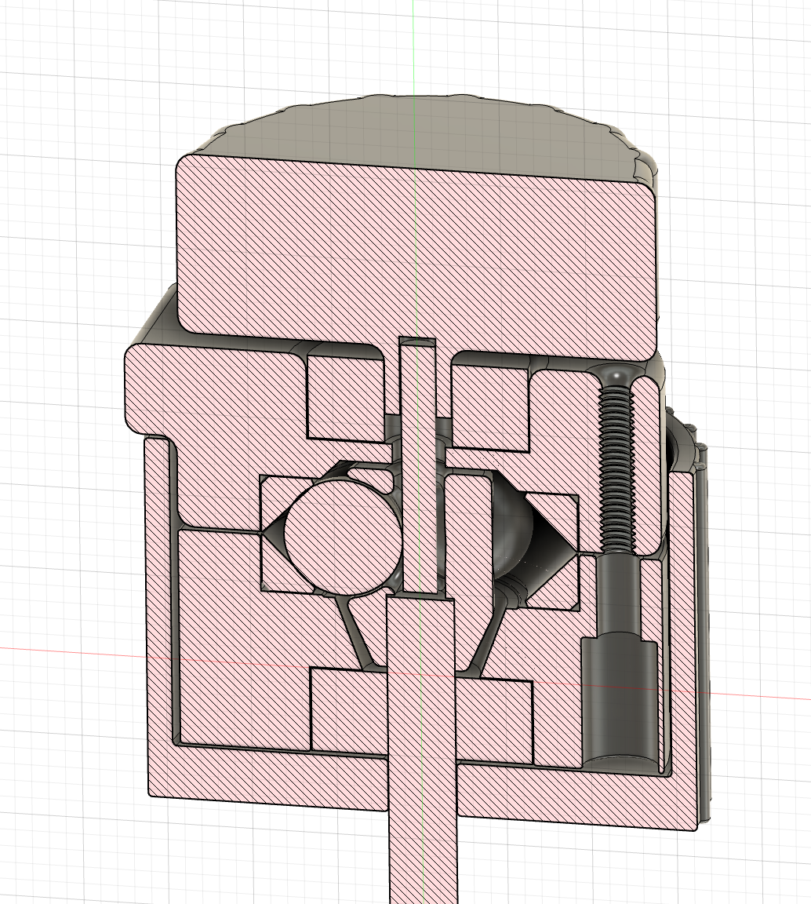

#  3D Printable 1:10 ball crayford reducer

## Advantages of a ball design

- No backlash
- No tilt in the axis
- Overall smoothness is great

## Challenges

- The contact surfaces (45° slopes) must be near perfect.

## BOM (temporary)

- 3 M3x16 screws
- 3 10mm steel balls
- 3 springs to load the screws
- A 3mm smooth pin
- A 608ZZ bearing

| | | |
|--|--|--|
||||

<video playsinline muted autoplay src="./IMG_9659.mp4"></video>