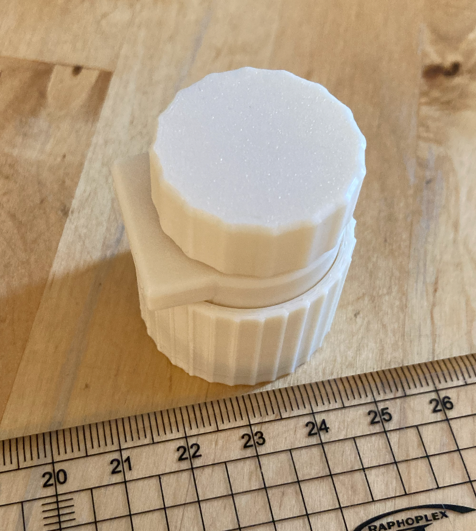

#  3D Printable 1:10 ball crayford reducer

## Advantages of a ball design

- No backlash
- No tilt in the axis
- Overall smoothness is great

## Challenges

- The contact surfaces (45° slopes) must be near perfect.

## BOM (temporary)

- 3 M2x16 screws
- 3 7mm steel balls
- A 2mm smooth pin
- 2 624zz bearing

| | | |
|--|--|--|
||||

